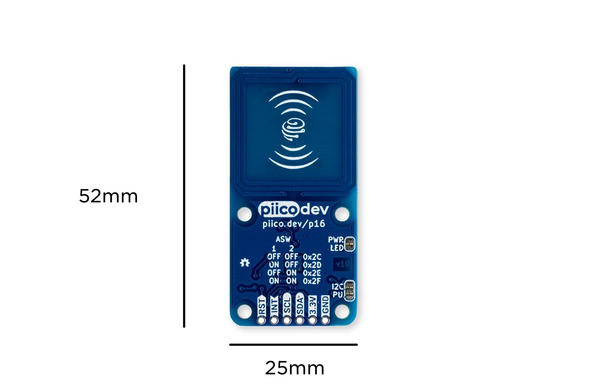

# STM32 Embedded Systems
This the the STM32CubeIDE workspace for the embedded systems relating to the ambient calendar design. The embedded systems handle the button control and NFC token detection system to detect the presence of user tokens. The source code can be found in the `/Core` directory. 

## STM32CubeIDE
[STM32CubeIDE](https://www.st.com/en/development-tools/stm32cubeide.html) is the official IDE for programming STM32 chips made by ST Microelectronics. The embedded systems was entirely developed in this IDE. To open this, clone the repository into your file system by running the following command:
```
git clone git@github.com:skill-issue-3801/embedded.git
```

Next, once you have [downloaded](https://www.st.com/en/development-tools/stm32cubeide.html) the IDE and cloned into the git repository. Open the IDE and select open workspace from the File dropdown menu. Select the STM32 folder in the git repository as the workspace. 

## FreeRTOS
This project utilises FreeRTOS to handle tasks such as reading from potentiometers and NFC cards and handling serial communication with the Pi concurrently.

### Serial Manager Task
The serial communication with the Rasberry Pi is handled by a FreeRTOS task, the communication uses the UART protocol. This exists in `/Core/Src/serial_manager.c`.

### GPIO Manager Task
The FreeRTOS task that handles the physical controls exists in `/Core/Src/gpio_manager.c`. The buttons are triggered on interrupt, whilst the potentiometers are triggered on polling. See the list of hardware below.

### NFC Task
The FreeRTOS tasks and Driver for the module exist entirely in the `/Core/Src/MRFC522.c` file, included by the `/Core/Inc/MRFC522.h` header file. The module connects to the STM32476rg using the I2C protocol. The implementation of this driver was influenced by the [Arduino driver](https://github.com/miguelbalboa/rfid/tree/master) for the same module. The FreeRTOS task detects when new tags have entered the RF field of the reader, and makes an exchange with the TAG to determine its ID, matching this with the internal user IDs saved in the code to determine which user has been detected.

### Event Manager Task
The event manager task receives inputs from the GPIO manager and NFC tasks and processes them. It forwards messages to the Serial Manager task to communicate inputs to the Rasberry Pi. This exists in `/Core/Src/event_manager.c`.

## List of Hardware
The Project uses the following hardware.
 * [NUCLEO-L476RG Development Board](https://www.st.com/en/evaluation-tools/nucleo-l476rg.html) by ST Microelectronics
 * [PiicoDev RFID Module (NFC 13.56MHz)](https://core-electronics.com.au/piicodev-rfid-module.html) by Core Electronics
 * [XIAO SAMD21(Seeeduino XIAO)](https://www.seeedstudio.com/Seeeduino-XIAO-Arduino-Microcontroller-SAMD21-Cortex-M0+-p-4426.html) by Seeed Studio
 * [RFID/NFC Tag 25mm Coin (NTAG213 Chip, 13.56MHz)](https://core-electronics.com.au/rfid-nfc-tag-25mm-coin-ntag213-chip-13-56mhz-pack-of-5.html) x 4
 * SPST (Single Pole Single Throw) Switches x 8
 * 5mm Green LEDS x 4
 * 10k Linear Single Gang Potentiometers x 2

### NUCLEO-L476RG
The main HAL and setup exist throughout the workspace. This is automatically generated by the STM32CubeIDE. This board houses the STM32L476rg chip which stands as the main device receiving input from all the controls as well as handling the communication with the Raspberry Pi and NFC module. 

### NFC Module and Tags
The tags are [NTAG213](https://core-electronics.com.au/attachments/uploads/NTAG213-215-216.pdf) tags that use the [ISO/IEC14443](http://www.emutag.com/iso/14443-3.pdf) Type A standard. The reader module uses a [MFRC522](https://www.nxp.com/docs/en/data-sheet/MFRC522.pdf) chip. 

### Seeeduino Xiao
As of current this just exists as an external power source for the NFC module. Instead of relying solely on the power from the Nucleo board, this allows the antenna on the NFC module to output the required power to generate the RF field for reading tags. 

### Input Switches and Dials
SPST Switches are used as buttons, Potentiometers as dials, and Green LEDs as indicator lights, these are the main interface switches in the system. The buttons are used as user selection if an NFC tag is not usable. The potentiometers control the brightness of selected user events. The LEDS are used an an indication of which user is currently selected. Otherwise, the other switches are used for scrolling and viewing future and past weeks. 

## Pinout
The pinout for the embedded systems is managed in the `/3801_Serial.ioc` file. Changing the pins in this file updates the pins used in all other files in the workspace. The defined pinout is as follows:

#### SPST Switches
* User 1 - PC10
* User 2 - PC11
* User 3 - PC12
* User 4 - PC13
* View Up - PC2
* View Down - PC3
* View Left - PH0
* View Right - PH1
#### Green LEDs
* User 1 - PC9
* User 2 - PC8
* User 3 - PC7
* User 4 - PC6
#### Potentiometers
* Screen Brightness - PC0
* User Brightness - PC1

#### RFID Module


* SCL - PB6
* SDA - PB7
* IRQ - PA7
* RST - PA6
* 3.3V - Xiao 3.3V
* GND - Xiao GND
